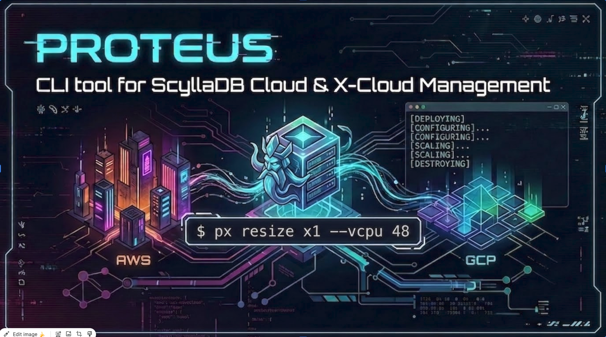

# Proteus



**Proteus** is a SAF-style CLI for managing [Scylla Cloud](https://cloud.scylladb.com/) and X-Cloud clusters. Named after the shape-shifting Greek sea god — one interface, many cloud forms.

```
px list                          # see all clusters in your account
px sync sc2                      # import an existing cluster into config
px setup x1                      # create a new cluster
px status x1                     # live node detail
px resize x1                     # apply scaling policy
px progress x1 --follow          # tail the active operation
px destroy x1                    # submit deletion, detach immediately
```

---

## Features

- **YAML-Declarative Config** — Define clusters once; run from anywhere
- **Multi-Cloud** — AWS and GCP via a unified interface
- **Cluster Lifecycle** — Create, resize, update, destroy (auto-clears `existing_cluster_id` on destroy)
- **Attach Existing Clusters** — One-line sparse entry (`existing_cluster_id: <id>`) + `px sync` auto-populates the full config from the API
- **`px sync`** — Discovers and writes back all cluster fields (type, cloud, region, version, CIDR, scaling policy, node groups) from a live cluster
- **X-Cloud Auto-Scaling** — Configure storage utilization and vCPU floor policies
- **Scylla Cloud Node Groups** — Resize named node groups independently
- **Two-Phase Resize Polling** — Tracks policy update → auto-scaler handoff for X-Cloud
- **Live Status Table** — SAF-style `[✔]`/`[✘]`/`[◑]` symbols across all configured clusters
- **Request Progress Tracking** — `px progress <cluster>` shows elapsed time, %, and description for any in-flight request; shows status for recently completed ones; `--follow`/`-f` tails it live
- **Local Request Cache** — `.px_requests.json` alongside config tracks `submitted_at`, `last_seen_active_at`, and `completed_at` (stamped on first 100% poll observation) for accurate tracking across sessions
- **SAF-Style Poll Output** — `[1m23s] [IN_PROGRESS] 67% — Rebalancing data` with deduped descriptions
- **`px list`** — Live account-wide cluster table with status, cloud/region, node count, and created date
- **Detach-by-Default Destroy** — `px destroy` returns immediately after submission; track deletion via `px progress`
- **Safety Guards** — `allow_create`/`allow_destroy` flags (default `false`) prevent accidental provisioning or deletion
- **Dry-Run Mode** — Preview API payload before applying
- **In-Progress Guard** — Blocks operations when a cluster request is already executing
- **Friendly-to-ID Mapping** — Resolves `cloud`/`region`/`instance_type` names to API IDs via `cloud-data.json`
- **Error Code Decoding** — Translates API error codes to actionable messages via `api_error_codes.tsv`
- **Run From Any Directory** — Config is pinned to `~/.config/proteus/config.yml` at install time

---

## Installation

```bash
git clone git@github.com:yourusername/proteus.git
cd proteus
./install.sh
source ~/.zshrc   # or ~/.bashrc
```

`install.sh` does three things:
1. Creates `.venv/` and installs dependencies from `pyproject.toml` (editable mode)
2. Adds `alias px="..."` to your shell config
3. Symlinks `~/.config/proteus/config.yml` → `<repo>/config.yml` so the CLI works from any directory

---

## Configuration

### Config File Location

Proteus searches for config in this order:

| Priority | Location |
|----------|----------|
| 1 | `--config <path>` CLI flag |
| 2 | `$PROTEUS_CONFIG` env var |
| 3 | `~/.config/proteus/config.yml` ← default after install |
| 4 | Walk up from CWD looking for `config.yml` with a `clusters:` key |

### Bootstrap

```bash
cp config.example.yml config.yml
# Edit config.yml with your cluster details
export SCYLLA_CLOUD_API_TOKEN="your-token-here"
```

Better to keep the `export SCYLLA_CLOUD_API_TOKEN="your-token-here"` in your `.bashrc` / `.zshrc` so that it's always available to Proteus!

The API token can also be embedded in `config.yml` under `api.token`, but using the environment variable is recommended.

### Full Example Config

```yaml
api:
  token: ${SCYLLA_CLOUD_API_TOKEN}   # or a literal token string
  timeout: 300
  ssl_verify: true
  ssh_key_public: ~/.ssh/id_ed25519.pub
  ssh_key_private: ~/.ssh/id_ed25519
  allow_create: false              # must be true to create new clusters
  allow_destroy: false             # must be true to destroy clusters

reference_data:
  cloud_data_path: ./cloud-data.json       # provider/region/instance ID map
  api_error_codes_path: ./api_error_codes.tsv
  auto_refresh: false                      # auto-refresh cloud-data.json on startup

clusters:
  x1:
    cluster_name: prod-xc-tester
    description: Production X-Cloud cluster on AWS
    cluster_type: x-cloud
    existing_cluster_id: 49495             # null if not yet created
    cloud: aws
    region: us-west-2
    scylla_version: 2026.1.3
    api_interface: CQL                     # CQL or ALTERNATOR
    replication_factor: 3
    broadcast_type: PRIVATE                # PRIVATE (VPC peering) or PUBLIC
    cidr_block: 172.31.0.0/24
    scaling:
      instance_families: [i8g]
      instance_types: []                   # empty = any type in family
      instance_type_ids: []                # explicit IDs override family lookup
      storage:
        min_gb: 1024
        target_utilization: 80             # scale-up when storage hits 80%
      vcpu:
        min: 6                             # scale-down floor
    vector_search:
      enabled: false
      count: 2
      instance_type: r7g.large

  sc1:
    cluster_name: prod-sc-gcp
    description: Standard Scylla Cloud cluster on GCP
    cluster_type: scylla-cloud
    existing_cluster_id: null
    cloud: gcp
    region: us-east1
    scylla_version: 2026.1.3
    api_interface: CQL
    replication_factor: 3
    broadcast_type: PRIVATE
    cidr_block: 172.31.1.0/24
    node_groups:
      - name: primary
        node_type: n2-highmem-8
        count: 3
```

---

## Configuration Reference

### `api` — Global API Settings

| Field | Type | Required | Description |
|-------|------|----------|-------------|
| `token` | string | Yes | API token. Prefer `${SCYLLA_CLOUD_API_TOKEN}` env substitution |
| `timeout` | int | No | Request timeout in seconds (default: `300`) |
| `ssl_verify` | bool | No | Verify TLS certificates (default: `true`). Set `false` for self-signed certs |
| `ssh_key_public` | string | Yes | Path to public SSH key provisioned on cluster nodes |
| `ssh_key_private` | string | Yes | Path to private SSH key (used for direct node access) |
| `allow_create` | bool | No | Allow `px setup` to create new clusters (default: `false`). Must be `true` to provision; attach via `existing_cluster_id` always works |
| `allow_destroy` | bool | No | Allow `px destroy` globally (default: `false`). Can be overridden per-cluster |

### `reference_data` — ID Mapping Files

| Field | Type | Description |
|-------|------|-------------|
| `cloud_data_path` | string | Path to `cloud-data.json`. Resolved relative to config file directory |
| `api_error_codes_path` | string | Path to `api_error_codes.tsv` |
| `auto_refresh` | bool | Refresh `cloud-data.json` from the API on every run (default: `false`) |

**ID resolution order:**
1. Explicit `resolved_ids.cloud_provider_id` / `resolved_ids.region_id` / `node_type_id` in config
2. Friendly-name lookup in `cloud-data.json` using `cloud`, `region`, `node_type`
3. If an API call fails, error code is decoded from `api_error_codes.tsv`

### Cluster Fields — Common (X-Cloud & Scylla Cloud)

| Field | Type | Required | Description |
|-------|------|----------|-------------|
| `cluster_name` | string | Yes | Cluster display name |
| `description` | string | No | Human-readable description |
| `cluster_type` | enum | Yes | `x-cloud` or `scylla-cloud` |
| `existing_cluster_id` | int | No | Numeric Scylla Cloud cluster ID. If set, `px setup` skips creation and attaches to the existing cluster instead. Written back automatically after a successful create. Use `px sync` to auto-populate all other fields from the API. |
| `cloud` | enum | Yes | `aws` or `gcp` |
| `region` | string | Yes | Cloud region (e.g. `us-west-2`, `us-east1`) |
| `scylla_version` | string | Yes | ScyllaDB version string (e.g. `2026.1.3`) |
| `api_interface` | enum | No | `CQL` (default) or `ALTERNATOR` (DynamoDB-compatible API) |
| `replication_factor` | int | No | Default replication factor (default: `3`) |
| `broadcast_type` | enum | Yes | `PRIVATE` (VPC peering) or `PUBLIC` |
| `cidr_block` | string | Yes | Cluster VPC CIDR. Must not overlap with loader or peer VPCs |
| `resolved_ids.cloud_provider_id` | int | No | Explicit `cloudProviderId` — skips lookup |
| `resolved_ids.region_id` | int | No | Explicit `regionId` — skips lookup |

### Cluster Fields — X-Cloud

| Field | Type | Required | Description |
|-------|------|----------|-------------|
| `scaling.instance_families` | list[str] | Yes | Instance families available to the auto-scaler (e.g. `[i8g]`). Only one allowed |
| `scaling.instance_types` | list[str] | No | Restrict to specific instance sizes. Empty = any size in family |
| `scaling.instance_type_ids` | list[int] | No | Explicit `instanceTypeID` values. Overrides family/type lookup |
| `scaling.storage.min_gb` | int | No | Minimum storage floor in GB (`0` = no floor) |
| `scaling.storage.target_utilization` | int | Yes | Storage % at which scale-up triggers (e.g. `80`) |
| `scaling.vcpu.min` | int | Yes | Minimum vCPU count — scale-down will not go below this |
| `vector_search.enabled` | bool | No | Attach vector search nodes (default: `false`) |
| `vector_search.count` | int | No | Number of vector search nodes |
| `vector_search.instance_type` | string | No | Instance type for vector search nodes |

### Cluster Fields — Scylla Cloud

| Field | Type | Required | Description |
|-------|------|----------|-------------|
| `node_groups` | list | Yes | One or more node group definitions |
| `node_groups[].name` | string | Yes | Group name, e.g. `primary`, `analytics` |
| `node_groups[].node_type` | string | Yes | Instance type, e.g. `i8g.4xlarge` |
| `node_groups[].node_type_id` | int | No | Explicit Scylla Cloud `instanceId` — skips type-name lookup |
| `node_groups[].count` | int | Yes | Node count in this group |

---

## CLI Reference

### Global Flags

These flags apply to every subcommand:

```
--config <path>           Path to config.yml (overrides all auto-discovery)
--api-token <token>       Override API token
--api-timeout <seconds>   Override request timeout
--no-ssl-verify           Disable TLS certificate verification
--cloud-data <path>       Override cloud-data.json path
--api-error-codes <path>  Override api_error_codes.tsv path
```

### `px setup <cluster-id>`

Create a new cluster or attach to an existing one.

After a successful create, Proteus automatically writes the returned cluster ID back to `existing_cluster_id` in `config.yml`. The `--write-back` flag is accepted for compatibility but is redundant — the save happens unconditionally.

```bash
px setup x1
px setup x1 --dry-run          # Print API payload, no API call
px setup x1 --no-wait          # Fire and forget (default: waits for completion)
px setup x1 --wait-timeout 7200 --poll-interval 30

# All values from CLI (no config required)
px setup --clusterid x1 --cluster-type x-cloud --cloud aws --region us-west-2 \
  --cluster-name my-cluster --scylla-version 2026.1.3 --cidr-block 172.31.0.0/24 \
  --instance-families i8g --storage-target-utilization 80 --vcpu-min 12
```

### `px resize <cluster-id>`

Update X-Cloud scaling policy or resize Scylla Cloud node groups.

```bash
px resize x1
px resize x1 --dry-run
px resize x1 --no-wait

# Override X-Cloud scaling policy values at the CLI without editing config
px resize x1 --vcpu 12 --storage-target-utilization 75
px resize x1 --vcpu 24 
px resize x1 --vcpu 24 --instance-families i4i 
px resize x1 --instance-families i7i

# Scylla Cloud: resize node group (count and/or instance type)
px resize sc1 --node-count 6
px resize sc1 --node-type i8g.8xlarge --node-count 6   # Not automated if --node-type does not match existing group
px resize sc1 --node-count 9

# --wanted-count is an alias for --node-count
px resize sc1 --wanted-count 6
```

**X-Cloud resize is two-phase:**
1. POST scaling policy update → poll until `COMPLETED`
2. Wait for the auto-scaler to pick up a `RESIZE_CLUSTER_*` request → poll to completion

### `px status [cluster-id]`

Show live cluster status. Fetches current data from the API on every call.

```bash
px status         # All configured clusters
px status x1      # Single cluster with full node detail
```

**Status table symbols:**

| Symbol | Meaning |
|--------|---------|
| `[✔]` | ACTIVE / COMPLETED |
| `[◑]` | Transitional (CREATING, UPDATING, MODIFYING, …) |
| `[✘]` | ERROR / FAILED / DELETED |
| `[–]` | Unknown / not yet provisioned |

### `px destroy <cluster-id>`

Delete a cluster. Three confirmation gates:

1. `allow_destroy: true` must be set in `api:` (or on the cluster itself) in `config.yml`
2. Interactive `yes/no` prompt (or pass `--yes` to skip)
3. Type the cluster name to confirm

Destroy **detaches immediately** after submission — it does not wait for deletion to complete. Use `px progress <cluster>` to track progress.

After submission, Proteus clears `existing_cluster_id` in `config.yml` (sets it to `null`) so the entry is ready for a fresh `px setup`. Skipped on `--dry-run` or declined confirmation.

```bash
px destroy x1                   # interactive prompts
px destroy x1 --yes             # skip yes/no prompt (still requires typing cluster name)
px destroy x1 --dry-run         # show target without calling the API
```

### `px progress <cluster-id>`

Show the current or most recently completed request for a cluster.

Proteus first checks the local request cache (`.px_requests.json`) for the most recently submitted request, then falls back to scanning the API's request list for any active `RESIZE_CLUSTER_*` operation.

**Output format (SAF-style):**
```
  [2m15s] [IN_PROGRESS] 42% — Rebalancing data
```

- Elapsed is computed from the locally cached `submitted_at` timestamp — accurate even across sessions.
- `completed_at` is stamped the first time a poll observes `100%`, keeping the completion time accurate regardless of whether `--follow` was used.
- When no active request exists, shows the last known status without a duration (the API provides no server-side timestamps).

```bash
px progress x1                  # snapshot: current status + elapsed
px progress x1 --follow         # tail: poll until completion, then exit
px progress x1 -f               # alias for --follow
px progress x1 --follow --poll-interval 10
```

Press `Ctrl+C` while following to detach: Proteus prints `Detached. Resume with: px progress x1 --follow` and exits cleanly.

### `px list`

List all clusters in the account (live from API, not from config). Shows ID, name, status, cloud/region, DC count, node count, and creation date.

```bash
px list           # formatted table
px list --json    # raw JSON response
```

The node count is derived from the replication factor per DC (the list API does not inline nodes). Creation date requires one additional API call per cluster and is always shown.

### `px sync <cluster-id>`

Populate a sparse config entry from the live cluster API. Only requires `existing_cluster_id` to be set; all other fields are discovered and written back automatically.

**Fields populated:** `cluster_name`, `cluster_type`, `cloud`, `region`, `scylla_version`, `api_interface`, `broadcast_type`, `cidr_block`, `replication_factor`, and either `scaling` (X-Cloud) or `node_groups` (Scylla Cloud).

```bash
px sync sc2
# Synced 'sc2' (cluster 49508) — 10 field(s) written:
#   cluster_type: x-cloud
#   cloud: gcp
#   region: asia-southeast1
#   ...
```

Running `px sync` again on a fully-populated entry is safe — it overwrites with current API values (useful for detecting drift).

### `px validate [cluster-id ...]`

Validate config structure and resolve all friendly names to API IDs using `cloud-data.json`.

```bash
px validate           # Validate all clusters in config
px validate x1 sc1   # Validate specific clusters
```

### `px cache-refresh-cloud`

Refresh `cloud-data.json` by fetching the latest provider/region/instance data from the Scylla Cloud deployment API.

```bash
px cache-refresh-cloud
```

### `px cloud-data`

Inspect resolved instance mapping for a region.

```bash
px cloud-data --cloud aws --region us-west-2
px cloud-data --cloud gcp --region us-east1 --families-only
```

---

## Usage Examples

### Create a new X-Cloud cluster

```yaml
# config.yml
clusters:
  x1:
    cluster_name: prod-xc
    cluster_type: x-cloud
    cloud: aws
    region: us-west-2
    scylla_version: 2026.1.3
    broadcast_type: PRIVATE
    cidr_block: 172.31.0.0/24
    scaling:
      instance_families: [i8g]
      storage:
        min_gb: 1024
        target_utilization: 80
      vcpu:
        min: 12
```

```bash
px setup x1 --dry-run
px setup x1               # cluster ID is saved to config.yml automatically
px status x1
```

### Resize an X-Cloud cluster

Edit `config.yml` to set the new floor:

```yaml
scaling:
  vcpu:
    min: 24
```

Then:

```bash
px resize x1 --dry-run
px resize x1
```

### Attach an existing cluster (using `px sync`)

You don't need to know any cluster details upfront. Start with the bare minimum:

```yaml
# config.yml — sparse entry, just the cluster ID
clusters:
  c1:
    existing_cluster_id: 49495
```

Then let Proteus discover and write back everything:

```bash
px sync c1
# Synced 'c1' (cluster 49495) — 10 field(s) written:
#   cluster_name: prod-xc-aws
#   cluster_type: x-cloud
#   cloud: aws
#   region: us-east-1
#   scylla_version: 2026.1.3
#   api_interface: CQL
#   broadcast_type: PRIVATE
#   cidr_block: 172.31.0.0/24
#   replication_factor: 3
#   scaling: {instance_families: [i4i], storage: {min_gb: 0, target_utilization: 75}, vcpu: {min: 8}}
```

Now the config is fully populated. Check status, then manage normally:

```bash
px status c1
px list
px resize c1 --vcpu 12
```

### Attach and resize an existing cluster (manual)

If you already know the cluster details, you can skip `px sync` and write the config directly:

```yaml
clusters:
  c1:
    cluster_type: x-cloud
    existing_cluster_id: 49495
    cloud: aws
    region: us-east-1
    scaling:
      instance_families: [i4i]
      storage:
        target_utilization: 75
      vcpu:
        min: 8
```

```bash
px status c1
px resize c1
```

### Resize a Scylla Cloud node group

```yaml
clusters:
  sc1:
    cluster_type: scylla-cloud
    existing_cluster_id: 12345
    node_groups:
      - name: primary
        node_type: i8g.8xlarge
        count: 5             # was 3
```

```bash
px resize sc1 --dry-run
px resize sc1
px status sc1
```

---

## Supported Regions

### AWS
`us-east-1`, `us-west-2`, `eu-west-1`, `eu-central-1`, `ap-southeast-1`, `ap-northeast-1`, and others.

### GCP
`us-central1`, `us-east1`, `europe-west1`, `asia-east1`, and others.

Run `px cloud-data --cloud aws --region us-west-2` to inspect what's available and mapped in your local `cloud-data.json`. Run `px cache-refresh-cloud` to pull the latest data from the API.

---

## Error Handling

| Error | Resolution |
|-------|-----------|
| `No config file found` | Set `$PROTEUS_CONFIG`, place config at `~/.config/proteus/config.yml`, or run `./install.sh` |
| `Missing API token` | `export SCYLLA_CLOUD_API_TOKEN=...` or set `api.token` in config |
| `Cluster not found in config` | Check the cluster ID matches a key under `clusters:` in config |
| `CIDR conflict` | Choose a `cidr_block` that doesn't overlap with existing cluster or peer VPCs |
| `In-progress request guard` | Another request is already running on this cluster; wait or use `px progress` to check |
| `Timeout` | Operation exceeded `--wait-timeout`; cluster may still be completing — use `px progress` |
| `allow_create is false` | Set `allow_create: true` under `api:` in config to enable cluster creation |
| `allow_destroy is false` | Set `allow_destroy: true` under `api:` in config (or per-cluster) to enable destruction |

---

## Troubleshooting

### Proteus picks up the wrong config

If you're running from a directory that has its own `config.yml` (e.g. SAF), Proteus may find that file instead. Solutions:

```bash
# Option 1: use the env var
export PROTEUS_CONFIG=~/Work/proteus/config.yml

# Option 2: use --config per call
px --config ~/Work/proteus/config.yml status

# Option 3: re-run install.sh to ensure ~/.config/proteus/config.yml symlink exists
./install.sh
```

### API authentication failed

```bash
echo $SCYLLA_CLOUD_API_TOKEN    # verify token is set
px list                        # quick API connectivity check
```

### Mapping lookup fails (`MappingError`)

```bash
px validate x1             # show what resolved and what failed
px cache-refresh-cloud     # pull fresh data from the API
px cloud-data --cloud aws --region us-west-2   # inspect local map
```

---

## Project Structure

```
proteus/
├── src/px/
│   ├── __init__.py
│   ├── __main__.py     # `python -m px` entrypoint
│   ├── api.py          # Scylla Cloud REST API client
│   ├── cli.py          # All subcommands and rendering logic
│   ├── config.py       # YAML config loading and path resolution
│   ├── errors.py       # API error code decoder
│   └── mapping.py      # cloud-data.json ID resolver
├── config.example.yml  # Annotated config template
├── cloud-data.json     # Provider/region/instance ID cache
├── api_error_codes.tsv # Error code → description map
├── CONFIGURATION.md    # Config field reference
├── DESIGN.md           # Architecture notes
├── pyproject.toml
└── install.sh
```

---

## License

Apache License 2.0

---

## Links

- [Scylla Cloud Documentation](https://docs.scylladb.com/scylla-cloud/)
- [Scylla Cloud API Reference](https://cloud.scylladb.com/)
